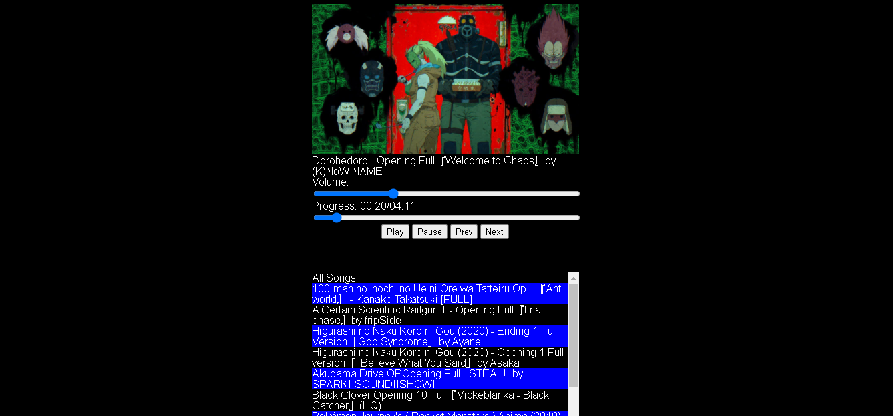
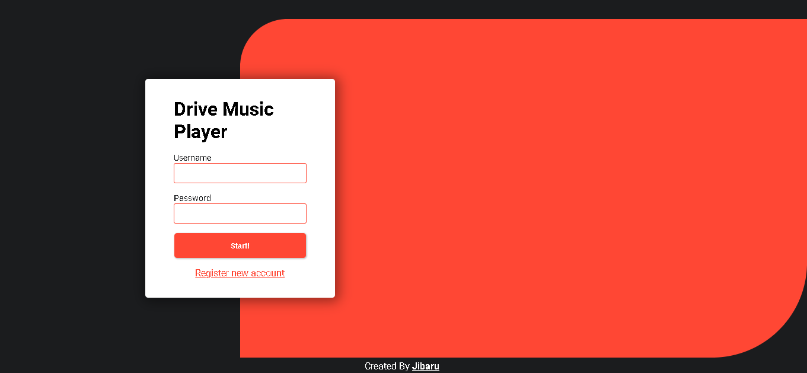
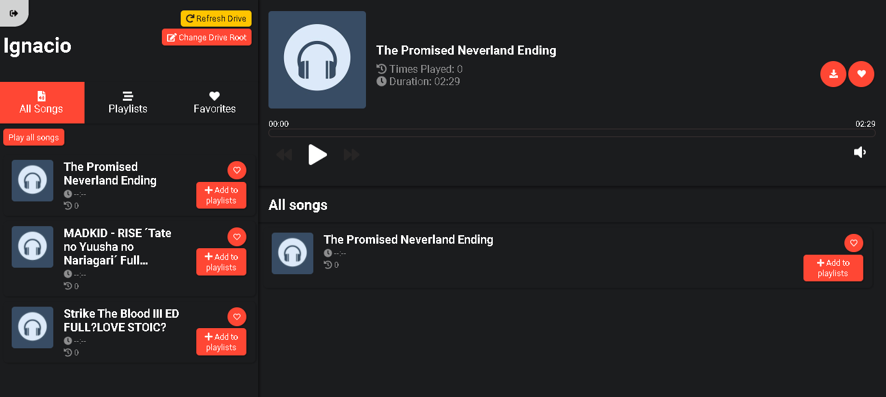
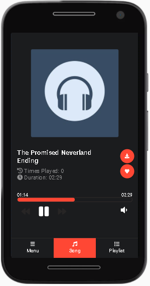

# Drive Music Player

A music player for Google Drive.

## Motivation 

Currently there are multiple services in the cloud to listen to music, however it is not possible to find certain songs or listen to custom songs / audios.

The first idea to find a solution to this problem was to use YouTube and the possibility of create video playlists. This idea was discarded because it is very easy for some audio to contain Copyright and YouTube ban the video.

I then proceeded to solve the problem using a player that stores songs in the cloud. However I did not find any (at least free) and those that existed were only for android / ios.

Given these problems, I decided to create a simple player. The idea was simple, upload my songs to google drive, copy the links to the songs and create a small list in Firebase so that the player could read it.

The result was the following:

The design is pretty ugly but it did the job.

However, after a few months the player became very difficult to use. It wasn't possible to create playlists and adding new songs was a slow process. Also, being created with pure javascript it was very difficult to make any changes.

It is then that I came to the conclusion that I should improve the player, with an automatic system that allows capturing the new songs added and the possibility of creating playlists.

To do this, I relied on my little experience in nodejs and vue, since they are both made in the same language, it would be easier for me to interact, also that vue seems very solid for what I wanted to do.

Finally, the result is the following:

And it has a web mobile version!

## Files supported

| Extension | mimetype      |
|-----------|---------------|
| flac      | audio/flac    |
| m3u       | audio/mpegurl |
| m3u8      | audio/mpegurl |
| m4a       | audio/mp4     |
| m4b       | audio/mp4     |
| mp3       | audio/mpeg    |
| ogg       | audio/ogg     |
| opus      | audio/ogg     |
| pls       | audio/x-scpls |
| wav       | audio/wav     |
| aac       | audio/aa      |

## Authentication Method

Simple email/user and password authentication. Don't use OAuth.

## Deployed App (DEMO)

[Drive Music Player](https://drive-music-player.herokuapp.com/)
